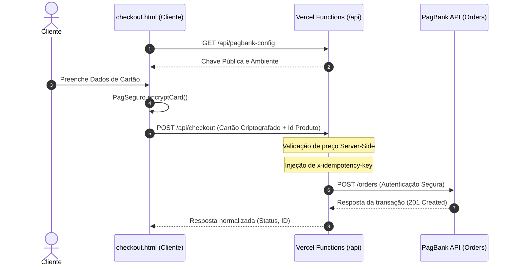

# Documentação de Integração — Checkout Transparente PagBank

Esta documentação detalha a arquitetura, segurança, configurações de ambiente e manutenção técnica do sistema de **Checkout Transparente do PagBank** integrado na infraestrutura da Vercel Serverless.

---

## 1. Arquitetura da Solução e Fluxo de Dados

A arquitetura foi projetada para garantir segurança máxima de dados de pagamento (PCI-DSS) e resiliência a transações repetidas:

---

## 2. Configurações de Variáveis de Ambiente (Vercel)

As seguintes variáveis de ambiente devem ser configuradas no painel administrativo da Vercel (ou em seu arquivo `.env` de desenvolvimento local):

| Variável | Tipo | Descrição |
| :--- | :--- | :--- |
| `PAGBANK_ENV` | Pública | Define o ambiente de processamento. Valores válidos: `sandbox` ou `production`. |
| `PAGBANK_TOKEN` | Secreta | O Bearer Token de API gerado no painel do PagBank para autenticar requisições de backend. |
| `PAGBANK_PUBLIC_KEY` | Pública | *(Opcional)* Chave pública de criptografia do PagBank. Se não configurada, o backend a buscará dinamicamente via API. |
| `APP_BASE_URL` | Pública | A URL de domínio do seu site para notificação de webhooks. Ex: `https://seu-site.vercel.app` |

---

## 3. Segurança Rígida de Pagamento

### A. Validação de Preço Server-Side (Fase 7)
Para impedir fraudes e adulterações de preço por usuários modificando requisições no DevTools do navegador:
1. O front-end envia apenas o **ID do produto** (`id`) e a **quantidade** (`quantity`) desejada.
2. O backend `/api/checkout` consulta a tabela interna de preços oficiais (livro = R$ 38,90), calcula o subtotal no servidor e envia o valor calculado estritamente no backend para a cobrança do PagBank.

### B. Proteção contra Cobrança Dupla por Idempotência (Fase 8)
- Um cabeçalho de requisição `x-idempotency-key` é gerado na sessão do navegador do cliente e persistido até a conclusão ou cancelamento do pagamento.
- Se o cliente clicar duas vezes no botão de confirmação ou se a conexão de rede cair no meio do processamento, a Vercel ou o PagBank saberão que se trata da mesma transação original e impedirão uma cobrança repetida.

### C. Proteção dos Segredos de API
- O Bearer Token do PagBank nunca é retornado nas respostas HTTP do servidor e não aparece em logs da Vercel.
- O front-end nunca faz chamadas diretas ao domínio do PagBank (exceto para carregar o script SDK do CDN oficial do banco).

---

## 4. Webhook e Notificações de Pagamento (Fase 10)

O endpoint de webhook em `/api/webhooks/pagbank` processa as notificações automáticas de mudança de status da transação.
- **Validação de Assinatura**: O webhook valida as notificações verificando o cabeçalho `x-authenticity-token` calculando o hash SHA-256 sobre a concatenação do seu `PAGBANK_TOKEN` com a payload bruta (`rawBody`) da requisição. Isso garante que a notificação foi de fato disparada de forma autêntica pelo PagBank.
- **Leitura do Raw Body**: O body parser padrão da Vercel foi desativado no endpoint de webhook para permitir a leitura dos bytes exatos e sem formatação do payload, impedindo erros de cálculo de assinatura gerados por strings reconstruídas.

---

## 5. Passagem de Sandbox para Produção

Para colocar a loja em modo real de vendas:
1. Acesse o painel da Vercel e altere a variável `PAGBANK_ENV` de `sandbox` para `production`.
2. Substitua a chave `PAGBANK_TOKEN` pelo token de produção gerado em sua conta comercial real do PagBank.
3. Se estiver usando a chave pública manual, atualize a `PAGBANK_PUBLIC_KEY` para a chave pública de produção. Caso contrário, a busca dinâmica da API fará a migração de forma automática.
4. Execute o deploy da aplicação no painel da Vercel.
